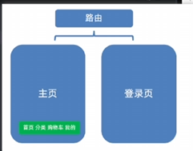
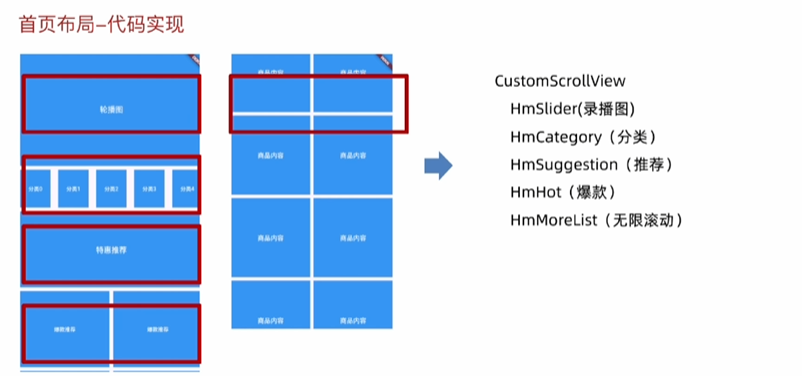

# 项目笔记

## 1.项目目录介绍
api： 存放请求
assets:存放资源
components:存放公共组件
contants: 存放常量文件
viewmodels:存放类型文件
pages：存放页面
routes：存放路由配置
stores:存放全局状态组件
utils：存放工具类
main.dart ： 入口文件 

## 2. 搭建基础路由和组件
应用的路由结构如下：

意思是只有两个页面，一个是主页，一个登陆页。至于分类、购物车、我的。只是主页的子组件。

## 3. 实现主页tab栏

底部tab我们是使用BottomNavigationBar去实现，它是可以切换索引的。

然后我们的每一个tab项对应的视图是通过SafeArea包裹IndexedStack组件实现的。IndexedStack组件可以设置索引号。

这样一来，我们点击哪个tab，就会切换到对应的视图。

## 3. 首页布局

新学到的知识点：
1. SliverGrid 和 SliverList 只支持纵向排列。
2. 作为SliverToBoxAdapter的子组件的话，子组件必须指定明确的高度。否则无法显示。

## 4.实现轮播图
本案例的轮播图，我们不采用PageView组件，因为PageView组件功能太单一了。我们使用第三方轮播图插件，所以我们需要安装一下：
flutter pub add carousel_slider

并且准备了几张供测试使用的网络图片，如下：
https://yiy-teach-oss.oss-cn-beijing.aliyuncs.com/meituan/1.jpg
https://yiy-teach-oss.oss-cn-beijing.aliyuncs.com/meituan/2.jpg
https://yiy-teach-oss.oss-cn-beijing.aliyuncs.com/meituan/3.jpg

学到的新知识：
1. 因为我们的轮播图数据可能是通过网络请求获取的，所以我们请求之后我们必须要知道用什么数据类型去接收这份接口返回的数据，所以我们需要在viewmodels中新建一个home.dart文件去定义类型。
你可能会说，之前第二阶段学习的时候，我们不是使用Map<String,dynamic>去接收接口返回的数据吗？
当然这样是可以的，但是如果你需要更明确的类型，那么你就需要定义一个类型。

## 5. 实现轮播图上面的搜索框和轮播图指示点
注意，我们这个应用中，搜索框我们只实现它的样式即可，不实现它的功能。

学到的新知识：
如果我们有一个Container组件，Container组件里面的某些样式是要在运行时通过三元表达式去判断而决定取值的，那么我们如果要为样式的变化设置一个动画效果的话，我们就需要使用AnimatedContainer组件。只需要指定一个动画时间，就直接实现了动画效果。十分的方便。

## 6.获取轮播图数据
我们要实现以下步骤：
1. 安装dio插件
2. 定义常量数据、基础地址、超时时间、业务状态、请求地址
3. 封装网络请求工具、基础地址、拦截器。
4. 请求工具进一步解构，处理http状态和业务状态
5. 类工厂转化动态类型到对象类型
6. 封装请求API调用工厂函数
7. 初始化数据更新状态